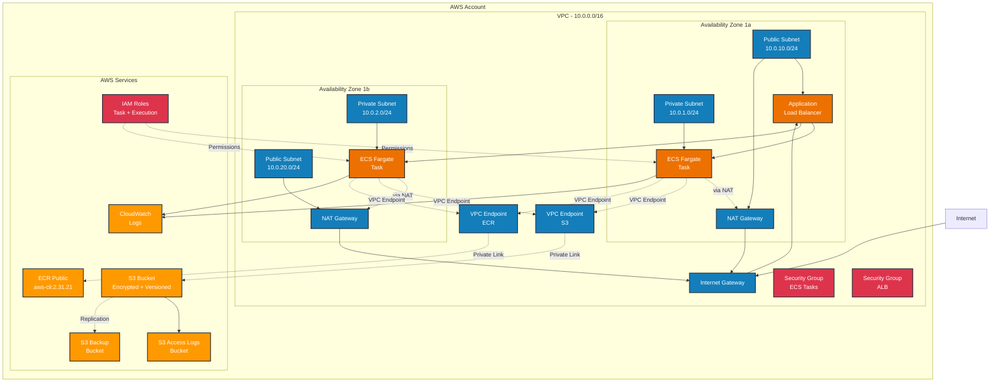

# Architecture Diagram

This file contains the Mermaid diagram for the AWS infrastructure architecture.

## Viewing the Diagram

This Mermaid diagram will render on GitHub and other Markdown viewers that support Mermaid syntax. 

For the best viewing experience:
- View on GitHub (native Mermaid support)
- Use the Mermaid Live Editor: https://mermaid.live/
- Use VS Code with the Mermaid extension

